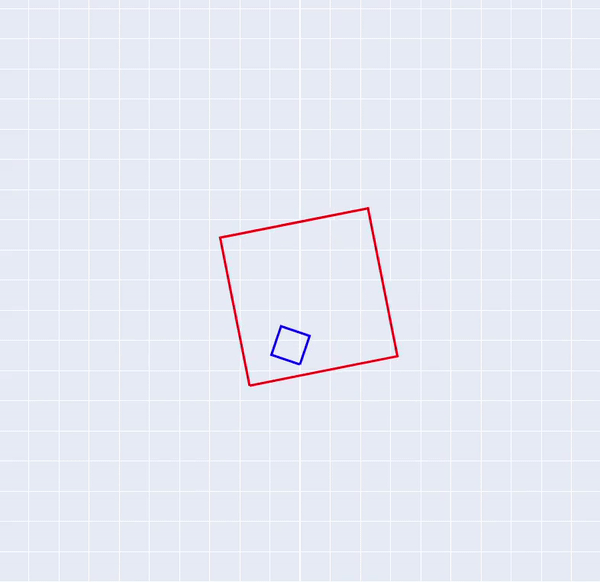

---

name: Euler-Lagrange Dynamics Simulation
tools: [Python, Dynamics]
image: images/final_demo.gif
description: 2D dice in a cup simulation using Euler-Lagrange equations

---

# Dice in a Cup

Code available on [GitHub](https://github.com/nmarks99/dice-in-a-cup)

The goal of this project was to simulate the dynamics of a 
cube boucing around inside a larger cube. This can be thought of
as similar to a single die sitting on a table, and a cup being 
placed over it and shaken. A more in depth description can be found
in the [PDF writup](https://github.com/nmarks99/dice-in-a-cup/blob/main/writeup.pdf).

This problem, especially with all the possible impacts, would be 
very difficult and tedious to solve using Newton's laws directly, 
however using the Euler-Lagrange equations, the problem is much
more doable. This is however somewhat computationally intensive.

