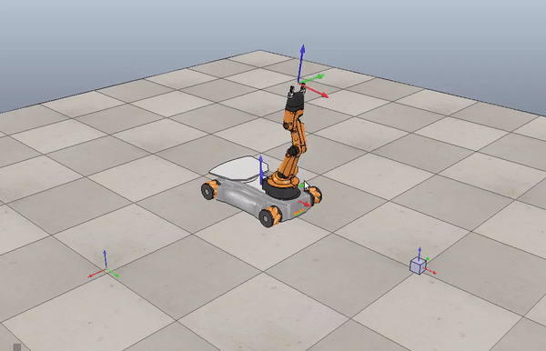

---

name: KUKA youBot Mobile Manipulator Simulation
tools: [Python, Robotics, Forward Kinematics, Inverse Kinematics]
image: images/youbot.gif
description: Simulation of a mobile manipulator robot completing a pick and place task

---

# KUKA youBot Simulation

Code available on [GitHub](https://github.com/nmarks99/youbot-sim)

Using Python, I wrote a program that generates joint trajectories for the KUKA youBot 
mobile manipulator and simulates them in CoppeliaSim. The task was to move the robot
to pick up a cube and place it at a goal location.

The code works by first generating a reference trajectory with the `TrajectoryGenerator`
function. Which generates a Cartesian trajectory using the `CartesianTrajectory()` function
in the [Modern Robotics](https://github.com/NxRLab/ModernRobotics) Python library.
Alteratively, this function can be substituted for the `ScrewTrajectory()` function
if you would prefer a screw trajectory.

Once a reference trajectory has been created, the program enters a loop which does the following:
- Runs a feedforward + PI controller based on the current
configuration and reference configuration to obtain control velocities to keep the robot
on the reference trajectory.

- Uses the control velocities from the feedback controller to compute
the configuration of the robot at the next step with a first order Euler step

- Finds the configuration of the end effector with forward kinematics.

- Saves the robot configuration and error in an array

After the main program loop completes, the robot configuration and error history arrays are
written to CSV files. To run display the trajectory in CoppeliaSim, you can simply input the
robot configuration history CSV file to a CoppeliaSim scene which is setup for the KUKA youBot.

